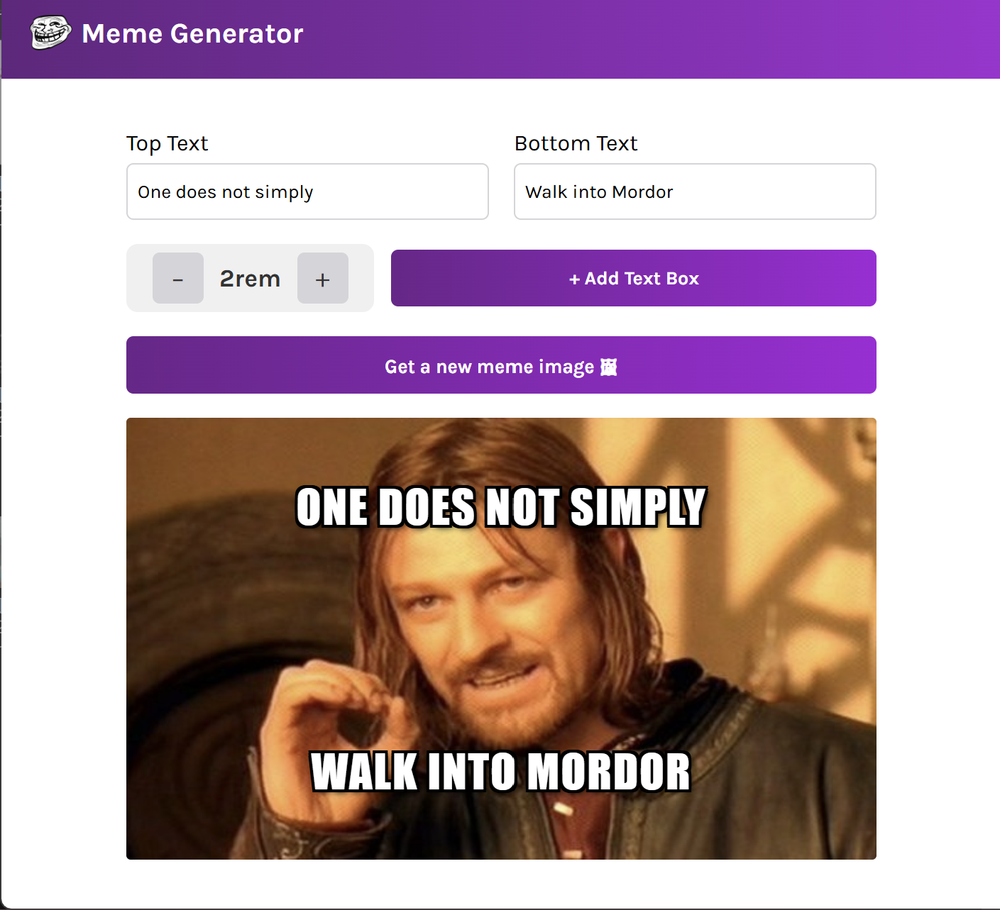

# Meme Generator

A fully interactive React-based meme generator that lets you create custom memes with unlimited text boxes, drag-and-drop positioning, and real-time editing.

## ▶️ Live Demo

[Try it live](https://gotham-citizen.github.io/Meme-Genrator/) — replace with the actual link once deployed

<a href="https://gotham-citizen.github.io/Meme-Genrator/">
  
</a>

## ✨ Features

- 🖼️ **Random Meme Templates** - Fetches the full meme list from the Imgflip API and cycles through random templates (never repeating the current image twice in a row)
- 📝 **Flexible Text Editing** - Edit the default top and bottom text, plus add as many custom text boxes as you like
- ➕ **Add/Remove Text Boxes** - Click "+ Add Text Box" to insert a new editable text box, or click the "×" button to remove one
- 🖱️ **Drag & Drop** - Reposition the top text, bottom text, or any custom text box by dragging it anywhere over the meme image
- 📏 **Editable Font Size** - Increase/decrease font size with +/− buttons, or click directly on the font size display to type a custom value (clamped between 0.5rem and 5rem)
- 🎯 **Smart Placeholder Behavior** - Text fields clear on focus if they still hold the default placeholder text, and restore the default if left empty on blur
- 🔄 **Image Cycling** - Get a new meme image while preserving all your text, positions, and font sizes
- 💅 **Authentic Meme Style** - Impact font, uppercase text, white fill with black outline/shadow for that classic meme look
- ⚠️ **Loading & Error States** - Friendly loading message while fetching templates and an error message if the API request fails

## 🛠️ Tech Stack

- **React** — UI library (hooks: `useState`, `useEffect`, `useRef`)
- **Imgflip API** (`api.imgflip.com/get_memes`) — Source of meme templates
- **CSS Grid & Flexbox** — Responsive form and control layout
- **Karla** (Google Font) — Body/UI typeface
- **Impact** — Meme text typeface

## 📦 Getting Started

### Installation

```bash
git clone <repo-url>
cd meme-generator
npm install
```

### Development

Start the dev server with hot module replacement:

```bash
npm run dev
```

### Build

Create a production build:

```bash
npm run build
```

Preview the production build locally:

```bash
npm run preview
```

### Lint

```bash
npm run lint
```

## 📁 Project Structure

```
meme-generator/
├── components/
│   ├── Header.jsx       # App header
│   └── Main.jsx          # Meme form, text inputs, drag-and-drop, and image display
├── src/
│   ├── App.jsx           # Root component
│   └── index.jsx         # React entry point
├── styles/
│   └── index.css         # Global styles (form, controls, draggable text, meme container)
├── index.html             # HTML entry point
├── vite.config.js         # Vite configuration
└── eslint.config.js       # ESLint configuration
```

## 🎯 How It Works

1. On mount, the app fetches the list of popular meme templates from the Imgflip API.
2. A default meme image and placeholder top/bottom text are shown.
3. Edit the **Top Text** and **Bottom Text** fields, or click **"+ Add Text Box"** to add additional custom text fields (they're laid out two per row, alternating columns).
4. **Drag any text** on the meme preview to reposition it — positions are stored as percentages so they stay correct if the image resizes.
5. Use the **+ / −** buttons to scale all text at once, or click the font size value itself to type an exact number.
6. Click **"Get a new meme image 🖼"** to swap in a different random template while keeping all your text, positions, and font sizes intact.
7. Click the **"×"** on any custom text box to remove it.

## 📝 Notes

- The font size display and custom text inputs use placeholder/default-value logic: leaving a field empty on blur restores its previous default rather than staying blank.
- Dragging is implemented with raw mouse events (`mousedown`/`mousemove`/`mouseup`) rather than the native HTML5 drag-and-drop API, so it works consistently across browsers.